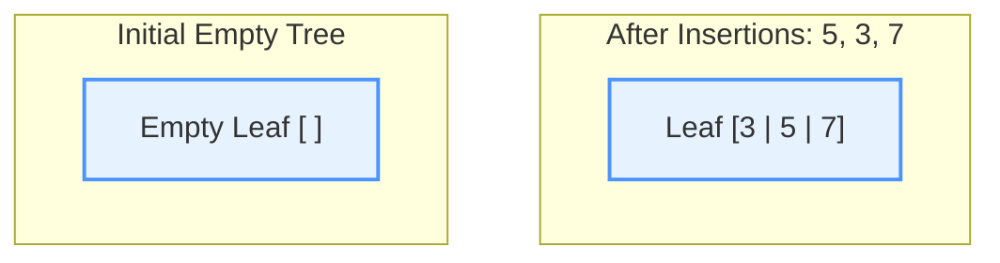
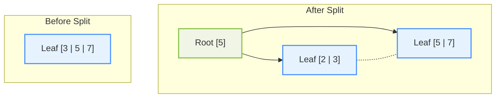
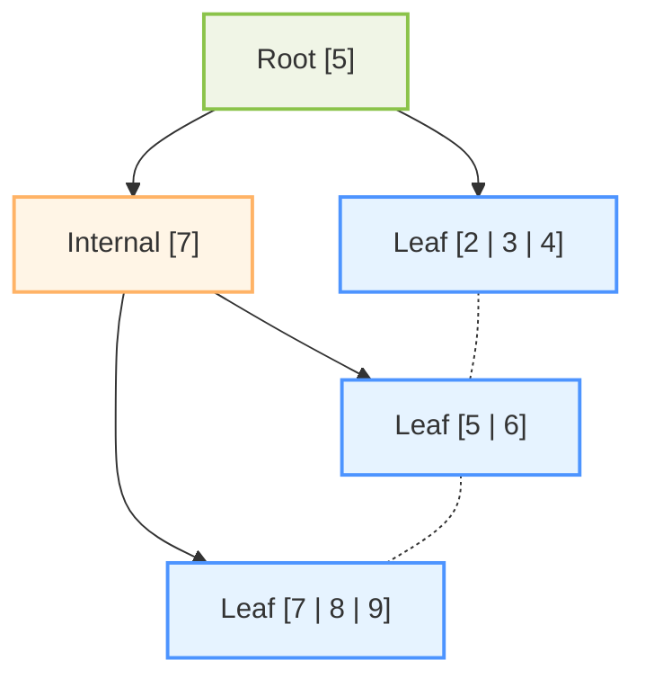
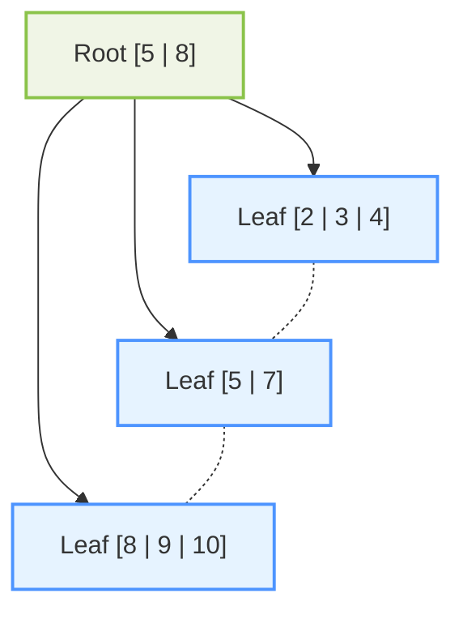
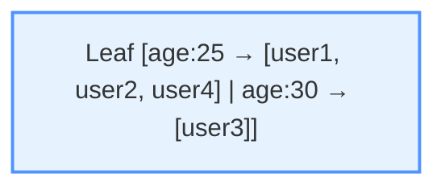
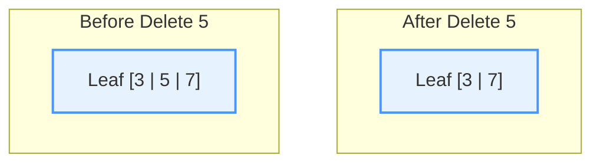
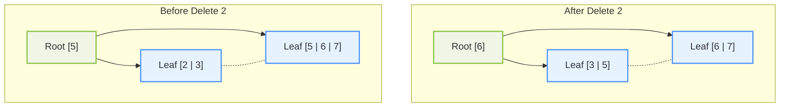
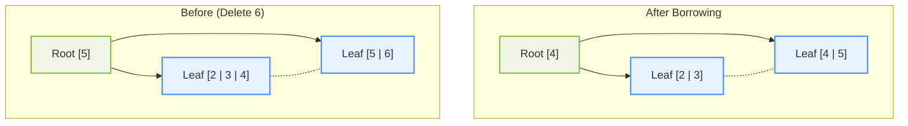
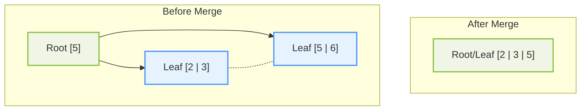
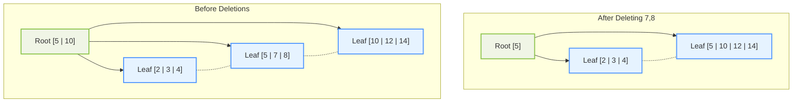

# B+ Tree Operations Guide

## Basic Structure (Order = 4)
Each node can have a maximum of 3 keys (order-1) and minimum of 1 key ((order-1)/2, rounded up).

### Initial Empty Tree and Basic Insertions



## 1. Node Splitting Operations

### Basic Split (Insert 2 into full node)



### Multi-Level Split Example (After inserting 1,4,6,8,9)



## 2. Complex Operations Examples

### Double Split Example (Insert 10)



### Multi-Value Keys Example
When handling duplicate values (e.g., for index trees), values are stored as lists:



## 3. Deletion Operations

### Simple Deletion (No Underflow)



### Deletion with Redistribution



## 4. Underflow Handling

### Case 1: Borrow from Left Sibling



### Case 2: Merge Nodes



## 5. Complex Scenarios

### Multiple Level Operations



## Implementation Notes

### Node Split Algorithm
```java
Node split() {
    int mid = keys.size() / 2;
    LeafNode newNode = new LeafNode();
    
    // Move half of keys and values to new node
    newNode.keys = new ArrayList<>(keys.subList(mid, keys.size()));
    newNode.values = new ArrayList<>(values.subList(mid, values.size()));
    
    // Update current node
    keys = new ArrayList<>(keys.subList(0, mid));
    values = new ArrayList<>(values.subList(0, mid));
    
    // Update links
    newNode.next = this.next;
    this.next = newNode;
    
    return newNode;
}
```

### Underflow Handling Algorithm
```java
private void handleUnderflow(int childIndex) {
    Node child = children.get(childIndex);
    
    // Try borrow from left
    if (childIndex > 0 && children.get(childIndex - 1).canLend()) {
        borrowFromLeft(childIndex);
    }
    // Try borrow from right
    else if (childIndex < children.size() - 1 && children.get(childIndex + 1).canLend()) {
        borrowFromRight(childIndex);
    }
    // Must merge
    else {
        mergeNodes(childIndex);
    }
}
```