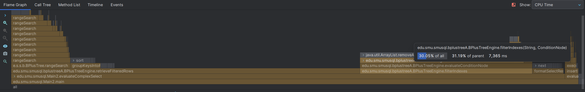

# Optimizing `combineResults()`
```java
private List<Integer> combineResults(List<Integer> leftResult, List<Integer> rightResult, String operator) {
    if (operator.equals("AND")) {
        leftResult.retainAll(rightResult);
        return leftResult;
    } else if (operator.equals("OR")) {
        leftResult.addAll(rightResult);
        return leftResult.stream().distinct().collect(Collectors.toList());
    } else {
        throw new RuntimeException("Unsupported logical operator: " + operator);
    }
}
```


> Taking longer than the actual tree traversal

## Updated Code
```java
    private List<Integer> combineResults(List<Integer> leftResult, List<Integer> rightResult,
        String operator) {
        if (leftResult == null || leftResult.isEmpty()) {
            return rightResult != null ? new ArrayList<>(rightResult) : new ArrayList<>();
        }
        if (rightResult == null || rightResult.isEmpty()) {
            return new ArrayList<>(leftResult);
        }

        if (operator.equals("AND")) {
            // Use HashSet for better performance with large datasets
            if (leftResult.size() > rightResult.size()) {
                // Swap to ensure we use the smaller list for the HashSet
                List<Integer> temp = leftResult;
                leftResult = rightResult;
                rightResult = temp;
            }

            // Create HashSet from the smaller list
            Set<Integer> rightSet = new HashSet<>(rightResult);
            List<Integer> result = new ArrayList<>();

            // Iterate through the smaller list
            for (Integer value : leftResult) {
                if (rightSet.contains(value)) {
                    result.add(value);
                }
            }
            return result;
        } else if (operator.equals("OR")) {
            // For OR operations, use HashSet for deduplication
            Set<Integer> uniqueResults = new HashSet<>(leftResult);
            uniqueResults.addAll(rightResult);
            List<Integer> result = new ArrayList<>(uniqueResults);
            Collections.sort(result);  // Maintain sorted order
            return result;
        } else {
            throw new RuntimeException("Unsupported logical operator: " + operator);
        }
    }
```


- Utilize a hashset to ensure unique rows

### AND operations
- Use the smaller list as the base hashset to reduce comparisons

### OR operations
- Just add everything

# Optimizing `retrieveFilteredRows()`

## Before


- 650000 Operations

```java
private Map<Integer, Map<String, Object>> retrieveFilteredRows(List<Integer> filteredKeys,
    BPlusTree<Integer, Map<String, Object>> rows) {

    // Group keys into ranges
    List<Range<Integer>> ranges = groupKeysIntoRanges(filteredKeys);

    // Retrieve filtered Rows
    Map<Integer, Map<String, Object>> filteredRows = new HashMap<>();

    for (Range<Integer> range : ranges) {
        List<Map<String, Object>> rangeRows = rows.rangeSearch(range.getStart(),
            range.getEnd());
        for (int i = 0; i < rangeRows.size(); i++) {
            Integer key = filteredKeys.get(filteredKeys.indexOf(range.getStart()) + i);
            filteredRows.put(key, rangeRows.get(i));
        }
    }
    return filteredRows;
}
```

## After


- 1 Million Operations

```java
    private Map<Integer, Map<String, Object>> retrieveFilteredRows(List<Integer> filteredKeys,
        BPlusTree<Integer, Map<String, Object>> rows) {

        // Pre-sort the filtered keys if not already sorted
        Collections.sort(filteredKeys);

        // Create an index mapping for quick lookup of original positions
        Map<Integer, Integer> keyPositionMap = new HashMap<>();
        for (int i = 0; i < filteredKeys.size(); i++) {
            keyPositionMap.put(filteredKeys.get(i), i);
        }

        // Group keys into ranges
        List<Range<Integer>> ranges = groupKeysIntoRanges(filteredKeys);

        // Retrieve filtered Rows
        Map<Integer, Map<String, Object>> filteredRows = new HashMap<>();

        int currentKeyIndex = 0;
        for (Range<Integer> range : ranges) {
            List<Map<String, Object>> rangeRows = rows.rangeSearch(range.getStart(), range.getEnd());

            // Calculate how many keys are in this range
            int keysInRange = keyPositionMap.get(range.getEnd()) - keyPositionMap.get(range.getStart()) + 1;

            // Map the results to their corresponding keys
            for (int i = 0; i < keysInRange; i++) {
                Integer key = filteredKeys.get(currentKeyIndex + i);
                if (i < rangeRows.size()) {  // Guard against potential index out of bounds
                    filteredRows.put(key, rangeRows.get(i));
                }
            }

            currentKeyIndex += keysInRange;
        }

        return filteredRows;
    }
```

Key Optimizations:

1. Eliminated the expensive indexOf() operations by:

    - Creating a keyPositionMap that stores each key's position in the filtered keys list
    - Using direct indexing to track positions with currentKeyIndex

2. Added efficiency improvements:

    - Pre-sorting the filtered keys if not already sorted
    - Using a HashMap for O(1) position lookups
    - Maintaining a running index counter instead of searching for positions


The time complexity improvements are:

- Original: O(n²) due to repeated indexOf() calls
- Optimized: O(n log n) for the initial sort, then O(n) for the rest of the operations

# Benchmark Results
    Time taken for 1000000 INSERT operations: 4.8537316 seconds
    Time taken for 1000000 SELECT operations: 875.0254231 seconds
    Time taken for 1000000 complex SELECT operations: 527.275861501 seconds
    Time taken for 1000000 UPDATE operations: 4.5755587 seconds
    Time taken for 1000000 complex UPDATE operations: 4.4934803 seconds
    Time taken for 1000000 DELETE operations: 2.2432603 seconds

## Analysis


    For each SELECT query:
    - retrieveTable: O(1)
    - filterIndexes: O(log n) for B+ tree operations
    - retrieveFilteredRows: O(k log n) where k = number of filtered keys
    - formatSelectResults: O(r * c) where:
        - r: number of rows
        - c: number of columns
    - Plus string operations cost for each cell

- Retrieving and computing each `SELECT *` statements would take too long

## Solution: Caching


    Cache Hit:
    - Cache lookup: O(1)
    - Skip all other operations

    Cache Miss:
    - Same as without cache + O(1) for cache insertion

- Eliminates Expensive Operations:
    - Skips row retrieval
    - Skips string formatting
    - Avoids StringBuilder operations