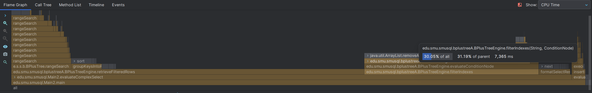

# Optimizing `combineResults()`
```java
private List<Integer> combineResults(List<Integer> leftResult, List<Integer> rightResult, String operator) {
    if (operator.equals("AND")) {
        leftResult.retainAll(rightResult);
        return leftResult;
    } else if (operator.equals("OR")) {
        leftResult.addAll(rightResult);
        return leftResult.stream().distinct().collect(Collectors.toList());
    } else {
        throw new RuntimeException("Unsupported logical operator: " + operator);
    }
}
```


> Taking longer than the actual tree traversal

## Updated Code
```java
    private List<Integer> combineResults(List<Integer> leftResult, List<Integer> rightResult,
        String operator) {
        if (leftResult == null || leftResult.isEmpty()) {
            return rightResult != null ? new ArrayList<>(rightResult) : new ArrayList<>();
        }
        if (rightResult == null || rightResult.isEmpty()) {
            return new ArrayList<>(leftResult);
        }

        if (operator.equals("AND")) {
            // Use HashSet for better performance with large datasets
            if (leftResult.size() > rightResult.size()) {
                // Swap to ensure we use the smaller list for the HashSet
                List<Integer> temp = leftResult;
                leftResult = rightResult;
                rightResult = temp;
            }

            // Create HashSet from the smaller list
            Set<Integer> rightSet = new HashSet<>(rightResult);
            List<Integer> result = new ArrayList<>();

            // Iterate through the smaller list
            for (Integer value : leftResult) {
                if (rightSet.contains(value)) {
                    result.add(value);
                }
            }
            return result;
        } else if (operator.equals("OR")) {
            // For OR operations, use HashSet for deduplication
            Set<Integer> uniqueResults = new HashSet<>(leftResult);
            uniqueResults.addAll(rightResult);
            List<Integer> result = new ArrayList<>(uniqueResults);
            Collections.sort(result);  // Maintain sorted order
            return result;
        } else {
            throw new RuntimeException("Unsupported logical operator: " + operator);
        }
    }
```


- Utilize a hashset to ensure unique rows

### AND operations
- Use the smaller list as the base hashset to reduce comparisons

### OR operations
- Just add everything