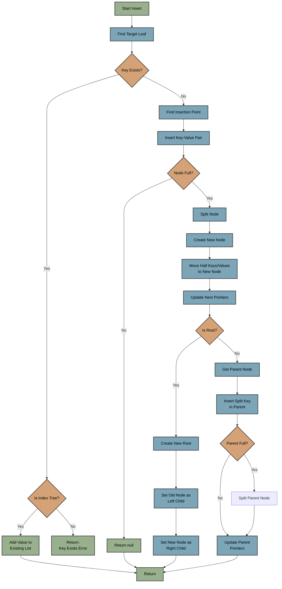
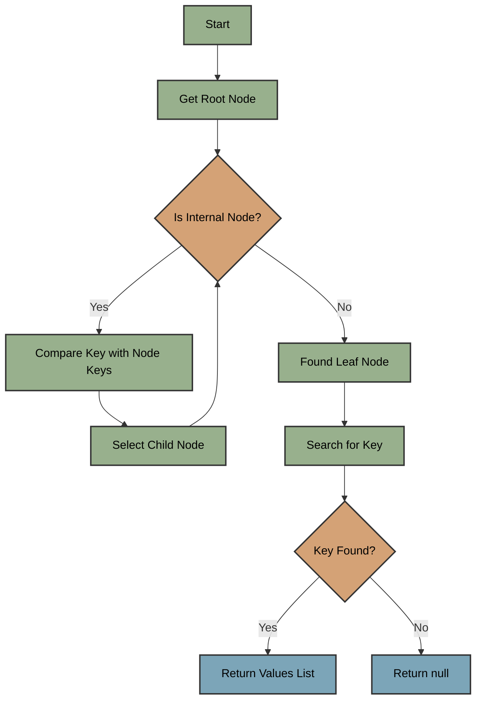
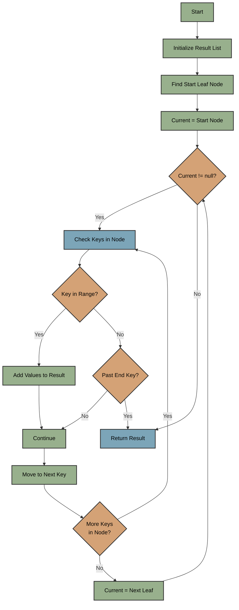
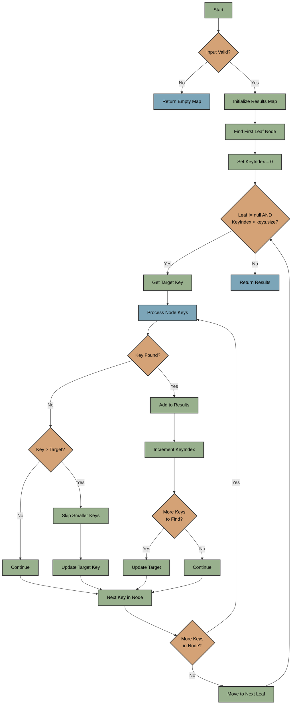
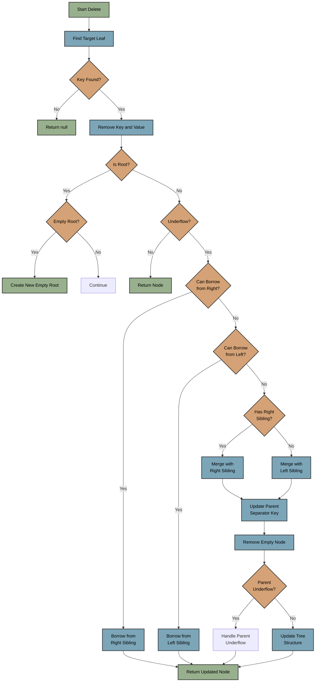
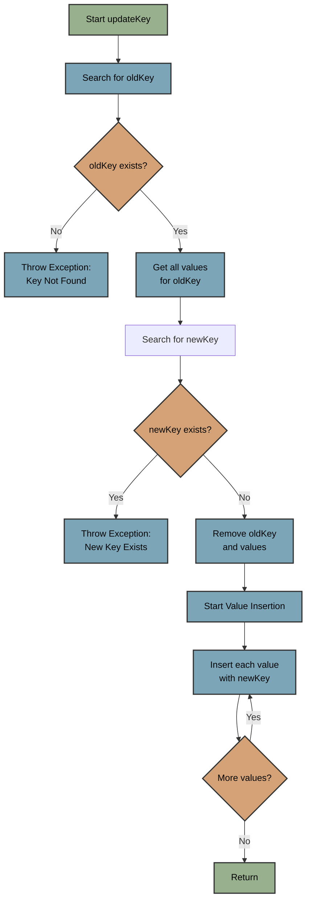

# B+ Tree Implementation

## BPlusTree Data Structure

### Structure Overview

The B+ Tree is implemented with a distinction between internal (routing) nodes and leaf nodes that
store actual data. This design enables efficient range queries and maintains data sorted at the leaf
level.

- Generic implementation supporting `Number` keys and any value type
- Configurable order for tree balancing (Using 128)
- Linked leaf nodes for efficient range queries
- Support for duplicate values in index trees

### Basic Components

#### 1. Core Classes

```java
public class BPlusTree<K extends Number, V> {

    private final int order;              // Maximum children per node
    private final NumberComparator comparator;
    private Node root;                    // Root node
    private LeafNode firstLeaf;           // First leaf for range queries
    private int size;                     // Total key-value pairs
}
```

- `K extends Number`: Enables numeric comparison for keys
- `V`: Any value type supported for flexibility in storage

#### 2. Node Types

```
- Abstract Node Base Class
  ├── Internal Node (routing)
  │   ├── Keys List
  │   └── Children List
  └── Leaf Node (data storage)
      ├── Keys List
      ├── Values List
      └── Next Leaf Pointer
```


##### Internal Node
- Internal nodes don't store values, only routing information

##### Leaf Node
- Leaf nodes store both keys and values in parallel lists
- `List<List<V>>` structure supports multiple values per key (for index trees)

### 1. Insertion Process



#### Steps:
1. Key Existence Check 

2. Insertion Phase
   - Find correct insertion point
   - Insert key-value pair
   - Check node capacity
   - Handle overflow if necessary

3. Split Process (Overflow)
   - Create new node
   - Calculate split point (size/2)
   - Move half of keys/values to new node
   - Update leaf node links
   - Handle parent references

### 2. Search Operations

#### Single Key Search



1. Input Validation
   - Check if key is not null
   - Verify root exists

2. Tree Traversal
   - Start at root node
   - Compare key with node's keys
   - Select appropriate child node
   - Repeat until leaf node reached

3. Key Search
   - Search for key in leaf node
   - Return list of values if found
   - Return null if not found

#### Range Search



1. Range Traversal
   - Start at leaf containing startKey
   - Process keys in current node
   - Follow next leaf pointer
   - Continue until endKey reached

2. Result Collection
   - Check each key against range
   - Collect matching values
   - Handle duplicate values
   - Early termination if past endKey

#### Multi-Key Search



1. Initial Setup
   - Find first leaf node
   - Get first target key

2. Search Process
   - Process keys in current leaf
   - Compare with target key
   - Handle matches and mismatches
   - Track progress through key list

3. Optimization Steps
   - Skip keys if target is larger
   - Early termination if all keys found
   - Handle boundary conditions

4. Result Management
   - Store matches in result map
   - Track found keys
   - Maintain key ordering
   - Handle multiple values per key

### 3. Deletion Operation



#### Steps:

1. Locate the key
2. Remove key and value
3. Handle underflow if necessary

### 4. Update Operations

#### Full Value Update (Used primarily in main tree operations)
1. Search for key in tree
2. Validate key exists
3. Create new single-value list
4. Replace all values for key
5. Return

#### Specific Value Update (Used in index tree operations) 

1. Search for key in tree 
2. Validate key exists 
3. Verify old value exists in value list 
4. Replace specific value while maintaining others 
5. Return

#### Key Update
- Moves all values from old key to new key
- Maintains value associations
- Handles key conflicts

