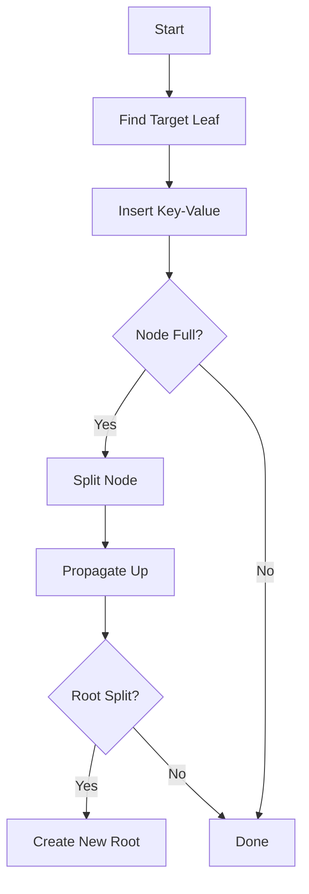
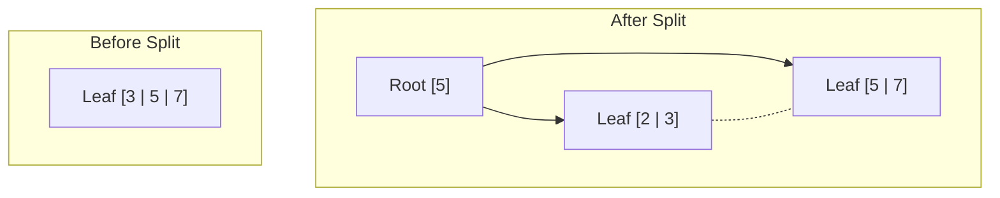
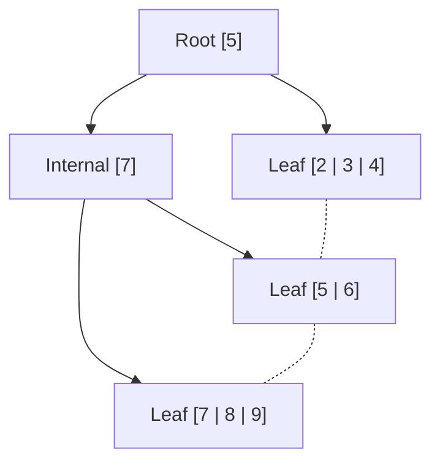
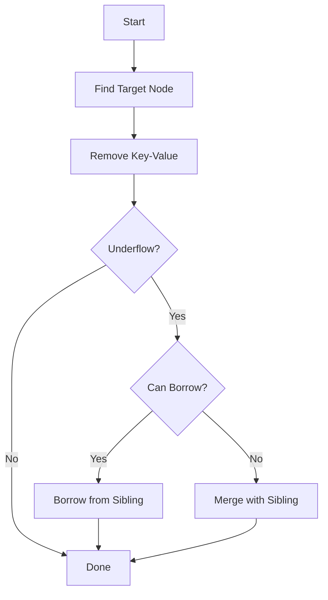

# B+ Tree SQL Engine Implementation

## Core Architecture

### 1. Main Components

- **BPlusTree**: Core data structure implementation
- **BPlusTreeEngine**: SQL query processing engine
- **BPlusTreeTableHashMap**: Table representation using B+ trees

### 2. Storage Structure

- **Main Tree**:
    - Key: Primary Key (Integer)
    - Value: Row Data (HashMap)
- **Index Trees**:
    - Key: Column Values
    - Value: Primary Keys
    - One index tree per column for efficient querying

## BPlusTree Data Structure

### Structure Overview

The B+ Tree is implemented with a distinction between internal (routing) nodes and leaf nodes that
store actual data. This design enables efficient range queries and maintains data sorted at the leaf
level.

- Generic implementation supporting `Number` keys and any value type
- Configurable order for tree balancing (Using 128)
- Linked leaf nodes for efficient range queries
- Support for duplicate values in index trees

### Basic Components

#### 1. Core Classes

```java
public class BPlusTree<K extends Number, V> {

    private final int order;              // Maximum children per node
    private final NumberComparator comparator;
    private Node root;                    // Root node
    private LeafNode firstLeaf;           // First leaf for range queries
    private int size;                     // Total key-value pairs
}
```

- `K extends Number`: Enables numeric comparison for keys
- `V`: Any value type supported for flexibility in storage

#### 2. Node Types

```
- Abstract Node Base Class
  ├── Internal Node (routing)
  │   ├── Keys List
  │   └── Children List
  └── Leaf Node (data storage)
      ├── Keys List
      ├── Values List
      └── Next Leaf Pointer
```

##### Abstract Node Base

```java
abstract class Node {

    List<K> keys;

    abstract List<V> search(K key);

    abstract Node insert(K key, V value);

    abstract K getFirstLeafKey();

    abstract List<V> rangeSearch(K startKey, K endKey);
}
```

##### Internal Node

```java
class InternalNode extends Node {

    List<Node> children;  // References to child nodes
}
```

- Internal nodes don't store values, only routing information

##### Leaf Node

```java
class LeafNode extends Node {

    List<List<V>> values;  // Lists of values for each key
    LeafNode next;         // Link to next leaf node
}
```

- Leaf nodes store both keys and values in parallel lists
- `List<List<V>>` structure supports multiple values per key (for index trees)

### 1. Insertion Process



#### Example Split Operation (Order = 4):

Basic Split (Insert 2 into full node)



Multi-Level Split Example (After inserting 1,4,6,8,9)



### 2. Search Operations

#### Single Key Search

1. Start at root
2. Follow internal nodes based on key comparisons
3. Reach leaf node
4. Return associated values

```java
public List<V> search(K key) {
    return root.search(key);
}
```

#### Range Search

Utilizes leaf node linking for efficient sequential access:

```java
public List<V> rangeSearch(K startKey, K endKey) {
    List<V> result = new ArrayList<>();
    LeafNode node = findLeaf(startKey);

    while (node != null) {
        for (int i = 0; i < node.keys.size(); i++) {
            K key = node.keys.get(i);
            if (key.compareTo(startKey) >= 0 &&
                key.compareTo(endKey) <= 0) {
                result.addAll(node.values.get(i));
            }
        }
        node = node.next;
    }
    return result;
}
```

#### Multi-Key Search
```java
    public Map<K, V> multiKeySearch(List<K> keys) {
  if (keys == null || keys.isEmpty() || root == null) {
    return new HashMap<>();
  }

  Map<K, V> results = new HashMap<>((int) (keys.size() / 0.75f) + 1);
  LeafNode leaf = getLeafNode(keys);
  int keyIndex = 0;

  // Traverse through leaf nodes
  while (leaf != null && keyIndex < keys.size()) {
    K targetKey = keys.get(keyIndex);

    // Process all matching keys in current leaf
    for (int i = 0; i < leaf.keys.size() && keyIndex < keys.size(); i++) {
      K leafKey = leaf.keys.get(i);
      int comparison = comparator.compare(leafKey, targetKey);

      if (comparison == 0) {
        // Found matching key
        results.put(targetKey, leaf.values.get(i).get(0));
        keyIndex++;
        if (keyIndex < keys.size()) {
          targetKey = keys.get(keyIndex);
        }
      } else if (comparison > 0) {
        // Current leaf key is greater than target
        if (comparator.compare(leafKey, keys.get(keys.size() - 1)) > 0) {
          // All remaining leaf keys will be too large
          return results;
        }
        while (keyIndex < keys.size() &&
                comparator.compare(keys.get(keyIndex), leafKey) < 0) {
          keyIndex++;
        }
        if (keyIndex < keys.size()) {
          targetKey = keys.get(keyIndex);
        }
      }
    }
    leaf = leaf.next;
  }

  return results;
}
```

- Optimized batch retrieval of multiple keys
- Single tree traversal for multiple keys
- Early termination when possible
- Efficient for sorted key lists

### 3. Deletion Process

#### Steps:

1. Locate the key
2. Remove key and value
3. Handle underflow if necessary

#### Underflow Policy

- Borrow from siblings
- Merge nodes if borrowing not possible



### 4. Update Operations

#### 1. Full Value Update
```java
public void update(K key, V newValue) {
    List<V> searchResult = search(key);
    if (searchResult == null || searchResult.isEmpty()) {
        throw new IllegalArgumentException("Key not found: " + key);
    }
    root.update(key, newValue);
}
```
- Replaces all values associated with a key
- Used primarily in main tree operations

#### 2. Specific Value Update
```java
public void updateValue(K key, V oldValue, V newValue) {
    List<V> searchResult = search(key);
    if (searchResult == null || searchResult.isEmpty()) {
        throw new IllegalArgumentException("Key not found: " + key);
    }
    if (!searchResult.contains(oldValue)) {
        throw new IllegalArgumentException("Old value not found for key: " + key);
    }
    root.updateValue(key, oldValue, newValue);
}
```
- Updates specific value for a key
- Maintains other values for the same key
- Used in index tree operations

#### 3. Key Update
```java
public void updateKey(K oldKey, K newKey) {
    List<V> values = search(oldKey);
    if (values == null || values.isEmpty()) {
        throw new IllegalArgumentException("Key not found: " + oldKey);
    }

    List<V> existingValues = search(newKey);
    if (existingValues != null && !existingValues.isEmpty()) {
        throw new IllegalArgumentException("New key already exists: " + newKey);
    }

    removeKey(oldKey);
    for (V value : values) {
        insert(newKey, value);
    }
}
```
- Moves all values from old key to new key
- Maintains value associations
- Handles key conflicts

### 5. Tree Maintenance
- Maintains minimum node occupancy `((order-1)/2)`
- Implements sibling redistribution
- Handles node merging when necessary
- Updates parent keys during restructuring

#### Split Operation (Node Overflow)

```java
Node split() {
    int mid = keys.size() / 2;
    LeafNode newNode = new LeafNode();

    // Move half of keys and values to new node
    newNode.keys = new ArrayList<>(keys.subList(mid, keys.size()));
    newNode.values = new ArrayList<>(values.subList(mid, values.size()));

    // Update current node
    keys = new ArrayList<>(keys.subList(0, mid));
    values = new ArrayList<>(values.subList(0, mid));

    // Update leaf node links
    newNode.next = this.next;
    this.next = newNode;

    return newNode;
}
```

#### Underflow Handling

```java
private void handleUnderflow(int childIndex) {
    Node child = children.get(childIndex);

    // Try borrow from siblings
    if (canBorrowFromLeft(childIndex)) {
        borrowFromLeft(childIndex);
    } else if (canBorrowFromRight(childIndex)) {
        borrowFromRight(childIndex);
    }
    // Must merge
    else {
        mergeWithSibling(childIndex);
    }
}
```

## BPlusTree Engine

### Operations Overview

#### Insert Process

1. Traverse to target leaf
2. Insert key-value pair
3. Handle node splitting if needed
4. Propagate changes upward
5. Update indexes

#### Delete Process

1. Locate target node
2. Remove key-value pair
3. Handle underflow
4. Update indexes
5. Invalidate cache

#### Select Process

1. Parse conditions
2. Utilize appropriate indexes
3. Retrieve filtered rows
4. Format results
5. Cache if applicable

### Performance Characteristics

#### Time Complexity

- Search: `O(log n)`
- Insert: `O(log n)`
- Delete: `O(log n)`
- Range Query: `O(log n + m)`
    - `n`: total nodes
    - `m`: elements in range

#### Memory Usage

- `O(n)` for primary data storage
- `O(kn)` for indexes
    - `k`: number of indexed columns
    - `n`: number of records

### Performance Optimizations

#### Caching System

- LRU cache implementation for SELECT queries
- Cache invalidation on data modifications

#### Result Combination

- Optimized AND/OR operations using HashSets
- Smart list size comparison for reduced operations

### Additional Features

- Multi-key search optimization
- Batch operation support
- Atomic operations for data consistency
- Complex condition evaluation
- Range-based querying

# Optimization Highlights

### Optimizing Result Combination (combineResults)

#### Original Implementation Issues


```java
private List<Integer> combineResults(List<Integer> leftResult, List<Integer> rightResult,
    String operator) {
    if (operator.equals("AND")) {
        leftResult.retainAll(rightResult);
        return leftResult;
    } else if (operator.equals("OR")) {
        leftResult.addAll(rightResult);
        return leftResult.stream().distinct().collect(Collectors.toList());
    } else {
        throw new RuntimeException("Unsupported logical operator: " + operator);
    }
}
```

- **AND Operations**: Uses `retainAll()` which has `O(n * m)` complexity
- **OR Operations**: Uses streams with `distinct()` which has `O(n log n)` complexity
- Very inefficient for large lists
- Performance bottleneck: Taking longer than tree traversal

#### Optimized Implementation


```java
    private List<Integer> combineResults(List<Integer> leftResult, List<Integer> rightResult,
    String operator) {
    if (leftResult == null || leftResult.isEmpty()) {
        return rightResult != null ? new ArrayList<>(rightResult) : new ArrayList<>();
    }
    if (rightResult == null || rightResult.isEmpty()) {
        return new ArrayList<>(leftResult);
    }

    if (operator.equals("AND")) {
        // Use HashSet for better performance with large datasets
        if (leftResult.size() > rightResult.size()) {
            // Swap to ensure we use the smaller list for the HashSet
            List<Integer> temp = leftResult;
            leftResult = rightResult;
            rightResult = temp;
        }

        // Create HashSet from the smaller list
        Set<Integer> rightSet = new HashSet<>(rightResult);
        List<Integer> result = new ArrayList<>();

        // Iterate through the smaller list
        for (Integer value : leftResult) {
            if (rightSet.contains(value)) {
                result.add(value);
            }
        }
        return result;
    } else if (operator.equals("OR")) {
        // For OR operations, use HashSet for deduplication
        Set<Integer> uniqueResults = new HashSet<>(leftResult);
        uniqueResults.addAll(rightResult);
        List<Integer> result = new ArrayList<>(uniqueResults);
        Collections.sort(result);  // Maintain sorted order
        return result;
    } else {
        throw new RuntimeException("Unsupported logical operator: " + operator);
    }
}
```

Improvements:

- **AND Operations**: Use the smaller list as the base hashset to reduce comparisons
- **OR Operations**: Deduplicate results with HashSet
- Utilized HashSet for O(1) lookups
- Reduced AND complexity to `O(n + m)`

### 2. Optimizing Row Retrieval (retrieveFilteredRows)

#### Original Implementation Issues

- Expensive `indexOf()` operations
- `O(n²)` time complexity
- Inefficient position tracking

#### Optimized Implementation


```java
private Map<Integer, Map<String, Object>> retrieveFilteredRows(List<Integer> filteredKeys,
    BPlusTree<Integer, Map<String, Object>> rows) {

    // Group keys into ranges
    List<Range<Integer>> ranges = groupKeysIntoRanges(filteredKeys);

    // Retrieve filtered Rows
    Map<Integer, Map<String, Object>> filteredRows = new HashMap<>();

    for (Range<Integer> range : ranges) {
        List<Map<String, Object>> rangeRows = rows.rangeSearch(range.getStart(),
            range.getEnd());
        for (int i = 0; i < rangeRows.size(); i++) {
            Integer key = filteredKeys.get(filteredKeys.indexOf(range.getStart()) + i);
            filteredRows.put(key, rangeRows.get(i));
        }
    }
    return filteredRows;
}
```

Key Improvements:

- Eliminated repeated `indexOf()` calls
- Added HashMap for `O(1)` position lookups
- Reduced complexity to `O(n log n)`
- Maintained running index counter

### 3. Expensive String Formatting (formatSelectResults)

#### Original Benchmark


#### Optimized Benchmark


#### Cache Structure
```java
public class CacheQueryKey {
    public final String tableName;
    public final ConditionNode whereClause;
    public final List<String> columns;
}

private final LRUCache<CacheQueryKey, String> queryCache;
```

#### Cache Operations

##### 1. Cache Check
```java
if (useCaching) {
    CacheQueryKey queryKey = new CacheQueryKey(
        node.getTableName(), 
        node.getWhereClause(),
        node.getColumns()
    );
    
    String cachedResult = queryCache.get(queryKey);
    if (cachedResult != null) {
        recordCacheHit();
        return cachedResult;
    }
    recordCacheMiss();
}
```

##### 2. Cache Invalidation
```java
private void invalidateCacheForTable(String tableName) {
    if (useCaching) {
        queryCache.entrySet().removeIf(
            entry -> entry.getKey().tableName.equals(tableName)
        );
    }
}
```

For expensive SELECT operations:

- Cache Hits: O(1) lookup
- Cache Misses: Original cost + O(1) insertion
- Eliminates:
    - Row retrieval operations
    - String formatting overhead
    - StringBuilder operations
    - Complex condition evaluations

The caching system significantly improved performance for repeated queries, especially for complex
SELECT operations with multiple conditions and large result sets.