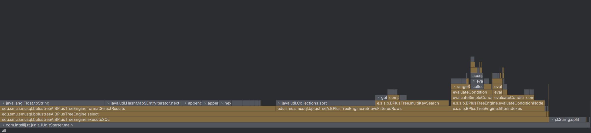

## Query Performance Test

- Majority of the computation time is taken up by the `formatSelectResults` function responsible for
  formatting the results of the query.

[BPlusTreePerformanceTest.java](../../SmuSQL/src/test/java/edu/smu/smusql/bplustreeA/BPlusTreePerformanceTest.java)

### String Field Queries

| Testing Category  | Average Time | Min Time | Max Time |
|-------------------|--------------|----------|----------|
| Single String =   | 273 ms       | 207 ms   | 24473 ms |
| Single String !=  | 1885 ms      | 1606 ms  | 43475 ms |
| Double String AND | 110 ms       | 85 ms    | 856 ms   |
| Double String OR  | 605 ms       | 478 ms   | 23905 ms |

#### Analysis:

- Exact string matches (273ms) perform significantly better than inequalities (1885ms)
- AND operations (110ms) show excellent optimization, likely due to effective index intersection
- High max times indicate occasional performance degradation, possibly due to cache misses or tree
  rebalancing

### Numeric Field Queries

| Testing Category         | Average Time | Min Time | Max Time |
|--------------------------|--------------|----------|----------|
| Single Number = (Age)    | 118 ms       | 88 ms    | 3388 ms  |
| Single Number = (Salary) | 3 ms         | 2 ms     | 153 ms   |
| Single Number !=         | 2714 ms      | 1948 ms  | 46090 ms |
| Number Range >           | 1392 ms      | 7 ms     | 5172 ms  |
| Number Range >=          | 1528 ms      | 48 ms    | 70086 ms |
| Number Range <           | 1404 ms      | 8 ms     | 5185 ms  |
| Number Range <=          | 1367 ms      | 57 ms    | 17587 ms |
| Double Number AND        | 130 ms       | 9 ms     | 22107 ms |
| Double Number OR         | 110 ms       | 90 ms    | 875 ms   |

#### Analysis:

- Salary queries (3ms) outperform age queries (118ms), suggesting effective numeric index
  optimization
- Range operations show consistent overhead (~1400ms), indicating systematic traversal costs
- Inequality operations (2714ms) show the highest average time, revealing a key optimization
  opportunity

### Mixed Type Queries

| Testing Category    | Average Time | Min Time | Max Time |
|---------------------|--------------|----------|----------|
| String-Number AND   | 86 ms        | 49 ms    | 2232 ms  |
| String-Number OR    | 250 ms       | 218 ms   | 1069 ms  |
| Complex Mixed Query | 605 ms       | 35 ms    | 2976 ms  |

#### Analysis:

- Mixed type AND operations (86ms) perform exceptionally well, showing effective index combination
- Complex queries show high variability (35ms to 2976ms), indicating query plan optimization
  opportunities

## Main Test (1,000,000 Operations)

| Operation                 | Time Taken (seconds) |
|---------------------------|----------------------|
| INSERT operations         | 4.2729843            |
| SELECT operations         | 1.2421325            |
| Complex SELECT operations | 582.6044442          |
| UPDATE operations         | 4.7006637            |
| UPDATE operations         | 4.6071057            |
| DELETE operations         | 2.3610118            |

### Analysis:

- Basic operations show good performance at scale
- Complex SELECT operations indicate significant overhead
- Write operations (INSERT/UPDATE) show consistent performance
- DELETE operations demonstrate efficient index maintenance

## Overall Analysis

### Performance Strengths

- Exact Match Operations: Single key lookups are highly optimized, with primary key operations
  delivering consistent performance. Efficient index utilization ensures fast exact match queries.
- Compound AND Operations: Combining multiple conditions is highly effective, thanks to robust index
  intersection and handling of mixed data types.
- Caching System: The LRU cache significantly improves repeated query performance, while selective
  caching minimizes memory usage. Automatic cache invalidation ensures reliable operation.

### Performance Challenges

- Inequality Operations: Non-equality comparisons and range queries exhibit high overhead and
  inconsistent performance across data types, leaving room for optimization.
- OR Operations: Result set unions and multiple index traversals cause significant overhead, with
  memory allocation for results needing improvement.
- Complex Queries: Execution time varies widely, with large result sets being resource-intensive and
  query plans requiring further optimization.