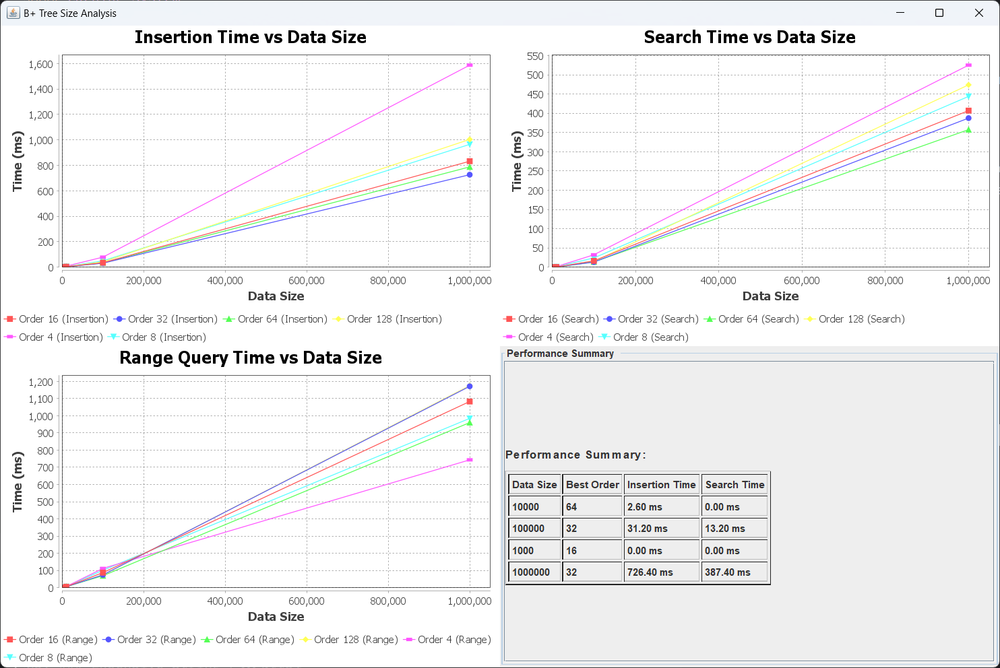

# B+ Tree Engine Implementation

## Core Architecture

### 1. Main Components

- **BPlusTree**: Core data structure implementation
- **BPlusTreeEngine**: SQL query processing engine
- **BPlusTreeTableHashMap**: Table representation using B+ trees

### 2. Storage Structure

- **Main Tree**:
    - Key: Primary Key (Integer)
    - Value: Row Data (HashMap)
- **Index Trees**:
    - Key: Column Values
    - Value: Primary Keys
    - One index tree per column for efficient querying

## BPlusTree Engine

### Operations Overview

#### Insert Operations


#### Delete Operations


#### Select Operations


#### Update Operations


### Performance Characteristics

#### Time Complexity

| Operation            | Average Case | Worst Case   | Notes                   |
|----------------------|--------------|--------------|-------------------------|
| Search (Point Query) | O(log n)     | O(log n)     | Using appropriate index |
| Insert               | O(log n)     | O(log n)     | Updates all indexes     |
| Delete               | O(log n)     | O(log n)     | Updates all indexes     |
| Range Query          | O(log n + m) | O(log n + m) | m = number of results   |
| Update               | O(log n)     | O(log n)     | Per index update        |
| Index Creation       | O(n log n)   | O(n log n)   | Full table scan         |

> n = number of records in table

#### Space Complexity

| Component            | Space Usage                                |
|----------------------|--------------------------------------------|
| Main Tree            | O(n) where n = number of records           |
| Each Index Tree      | O(n) per indexed column                    |
| Total with k indexes | O(n * (1 + k)) where k = number of indexes |

### Caching System

- LRU cache implementation for SELECT queries
- Cache invalidation on data modifications

# Design Decision Highlights

### Optimizing B+ Tree Order

In order to identify the best order for the B+ tree, we conducted a series of benchmarks to
evaluate.

#### Experiment Setup

- Tested orders: 16, 32, 64, 128
- Dataset sizes: 1K, 10K, 100K, 1M records
- Measured metrics:
    - Insertion time
    - Search time
- Each test repeated multiple times to ensure consistent results

#### Benchmark Results



- Smaller datasets (1K) perform well with order 16
- Medium datasets (10K) benefit from larger order (64)
- Large datasets (100K-1M) perform best with order 32
- Very large orders (128+) showed diminishing returns

Based on these findings, we decided to use a default order of 32 as it provides consistent
performance across different dataset sizes

### Optimizing Result Combination (combineResults)

#### Original Implementation Issues


```java
private List<Integer> combineResults(List<Integer> leftResult, List<Integer> rightResult,
    String operator) {
    if (operator.equals("AND")) {
        leftResult.retainAll(rightResult);
        return leftResult;
    } else if (operator.equals("OR")) {
        leftResult.addAll(rightResult);
        return leftResult.stream().distinct().collect(Collectors.toList());
    } else {
        throw new RuntimeException("Unsupported logical operator: " + operator);
    }
}
```

- **AND Operations**: Uses `retainAll()` which has `O(n * m)` complexity
- **OR Operations**: Uses streams with `distinct()` which has `O(n log n)` complexity
- Very inefficient for large lists
- Performance bottleneck: Taking longer than tree traversal

#### Optimized Implementation


Improvements:

- **AND Operations**: Use the smaller list as the base hashset to reduce comparisons
- **OR Operations**: Deduplicate results with HashSet
- Utilized HashSet for O(1) lookups
- Reduced AND complexity to `O(n + m)`

### Optimizing Row Retrieval (retrieveFilteredRows)

#### Original Implementation Issues


```java
private Map<Integer, Map<String, Object>> retrieveFilteredRows(List<Integer> filteredKeys,
    BPlusTree<Integer, Map<String, Object>> rows) {

    // Group keys into ranges
    List<Range<Integer>> ranges = groupKeysIntoRanges(filteredKeys);

    // Retrieve filtered Rows
    Map<Integer, Map<String, Object>> filteredRows = new HashMap<>();

    for (Range<Integer> range : ranges) {
        List<Map<String, Object>> rangeRows = rows.rangeSearch(range.getStart(),
            range.getEnd());
        for (int i = 0; i < rangeRows.size(); i++) {
            Integer key = filteredKeys.get(filteredKeys.indexOf(range.getStart()) + i);
            filteredRows.put(key, rangeRows.get(i));
        }
    }
    return filteredRows;
}
```

- Expensive `indexOf()` operations
- `O(n²)` time complexity
- Inefficient position tracking

#### Optimized Implementation


Key Improvements:

- Eliminated repeated `indexOf()` calls
- Added HashMap for `O(1)` position lookups
- Reduced complexity to `O(n log n)`
- Maintained running index counter

### Expensive String Formatting (formatSelectResults)

#### Original Benchmark


#### Optimized Benchmark


Implemented a LRU cache for expensive SELECT operations:

- Cache Hits: O(1) lookup
- Cache Misses: Original cost + O(1) insertion
- Eliminates:
    - Row retrieval operations
    - String formatting overhead
    - StringBuilder operations
    - Complex condition evaluations
