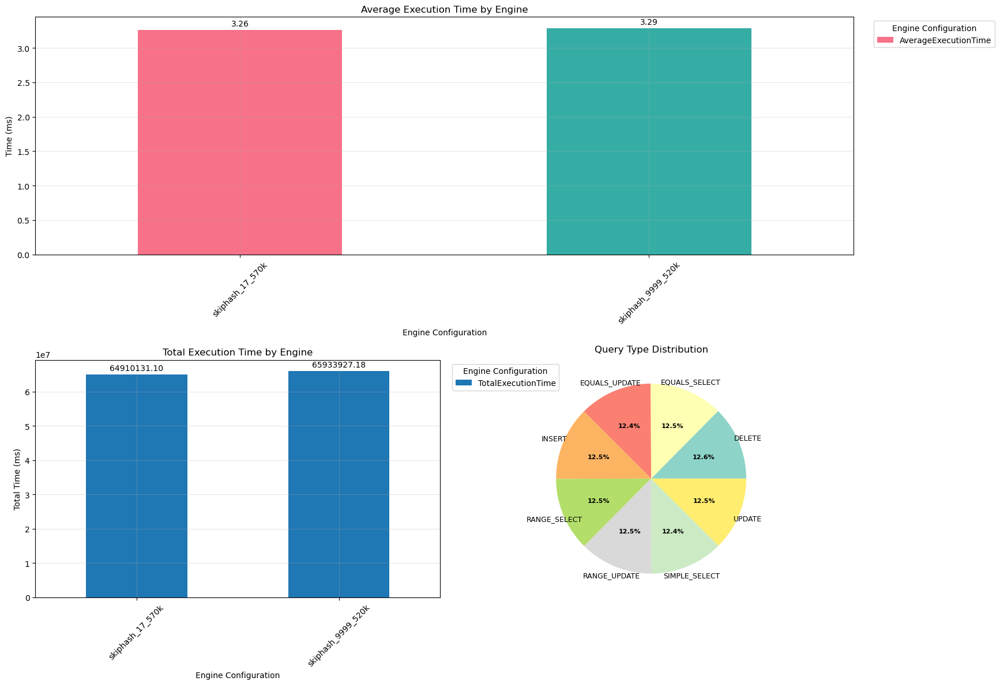
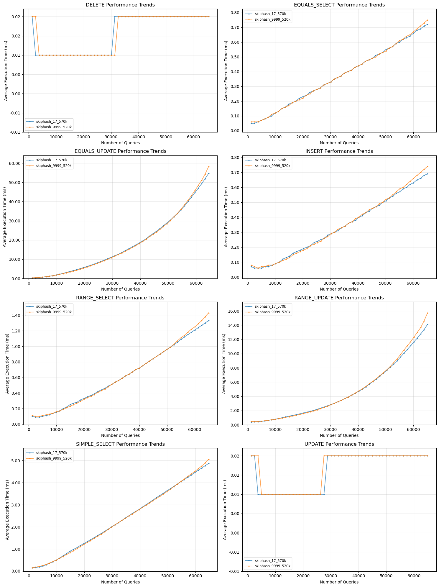
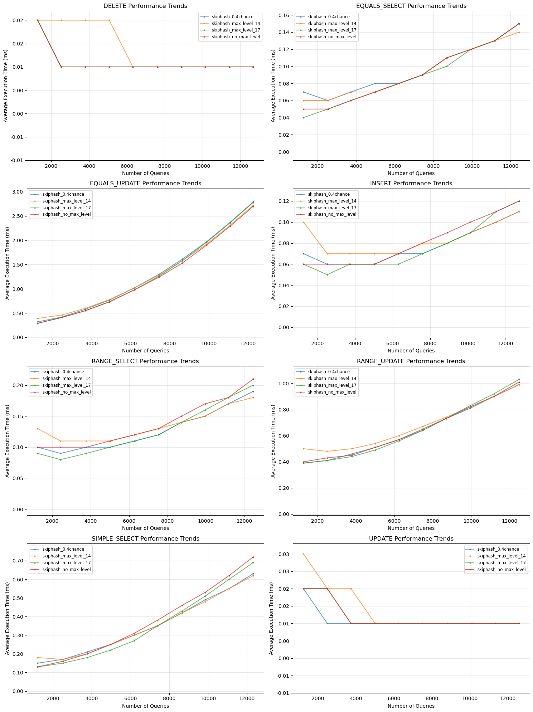

Average performance change when setting max level. Red graph refers to max_level of 17, and green graph refers to the max level of 9999, used to simulate no cap on max level.

The max level of 17 was chosen due to it being approximately log2(100_000), the size of the data we were testing on.

Setting a max level does not drastically improve performance. However, a clear seperation can be seen where max level setting improves the performance marginally at higher query and database sizes, and the 2 graphs diverge.

We also performed the test at 100K queries as well, but for different settings of the skip list, such as a lowered proability of 0.4, different max_level settings and default: no max level and 0.5 probabilty of increasing level. From the graphs, we can tell that max level of 14, the orange line in the graphs in the last image, very slightly edges out all the other configurations towards the ends, which solidifies our hypothesis that log2(N) data size would work best. The 100k queries has roughly 12.5k insert operations and hence, the size of the database is around 12.5k, and log2(12.5k) is approximately 14. However, it is slightly worse at the start, for reasons unclear. Perhaps statistical fluctuations at smaller query sizes.